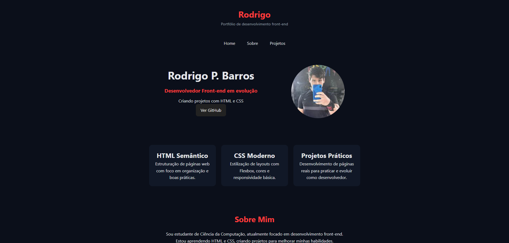

# 💻 Portfólio Pessoal | Rodrigo P. Barros

## 📌 Sobre o Projeto
Este é o meu portfólio pessoal, desenvolvido para centralizar meus projetos, habilidades e minha evolução como desenvolvedor front-end. O design foi pensado para ser minimalista e funcional, utilizando uma paleta de cores escura com alto contraste para facilitar a leitura e navegação.

> **Acesse online:**

---

## 🛠️ Tecnologias e Conceitos
Para a construção deste portfólio, utilizei:
- **HTML5 Semântico:** Para garantir uma boa estrutura e acessibilidade.
- **CSS3 (Custom Properties):** Uso de variáveis para manter a consistência de cores e facilitar futuras mudanças de tema.
- **Flexbox & Grid:** Para criar um layout responsivo que se adapta a computadores e celulares.
- **Clean UI:** Foco em uma interface limpa, sem distrações desnecessárias.

---

## 📂 Projetos em Destaque
Dentro deste portfólio, você encontrará links para outros trabalhos, como:
- **Persona 4 Golden Fan Page:** Estudo de UI avançada e animações.
- **Perfil de Jogos:** Meu primeiro projeto prático focando em listas e cards.

---

## 🚀 Meu Objetivo
Atualmente, estou focado em dominar o ecossistema Front-end, aprimorando meus conhecimentos em **HTML, CSS e JavaScript**, além de explorar ferramentas de design para criar interfaces cada vez mais profissionais.

---

## 📫 Contato
- **GitHub:** [@RodrigoPBarros](https://github.com/RodrigoPBarros)
- **Instagram:** [@rodrigobarros499](https://www.instagram.com/rodrigobarros499/)

---
*Este portfólio está em constante atualização conforme novos desafios surgem.*
